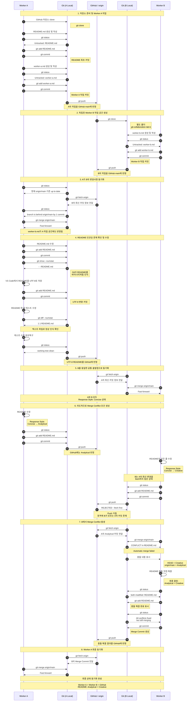

# Git Collaboration Lab

## AI Assistant Configuration

Response Style: Creative
Response Style: Analytical

```mermaid
sequenceDiagram
    autonumber

    participant A as Worker A
    participant GA as Git (A Local)
    participant GH as GitHub / origin
    participant GB as Git (B Local)
    participant B as Worker B

    Note over A,B: 1. 저장소 준비 및 Worker A 작업

    A->>GA: GitHub 저장소 clone
    Note right of GA: git clone

    A->>GA: README.md 생성 및 작성
    A->>GA: git status
    GA-->>A: Untracked: README.md

    A->>GA: git add README.md
    A->>GA: git commit
    Note right of GA: README 최초 커밋

    A->>GA: worker-a.md 생성 및 작성
    A->>GA: git status
    GA-->>A: Untracked: worker-a.md

    A->>GA: git add worker-a.md
    A->>GA: git commit
    Note right of GA: Worker A 작업 커밋

    GA->>GH: git push
    Note over GA,GH: A의 작업을 GitHub main에 반영


    Note over A,B: 2. 독립된 Worker B 작업 공간 생성

    GH->>GB: git clone
    Note right of GB: 별도 폴더<br/>git-collaboration-lab-b

    B->>GB: worker-b.md 생성 및 작성
    B->>GB: git status
    GB-->>B: Untracked: worker-b.md

    B->>GB: git add worker-b.md
    B->>GB: git commit
    Note right of GB: Worker B 작업 커밋

    GB->>GH: git push
    Note over GB,GH: B의 작업을 GitHub main에 반영


    Note over A,B: 3. A가 B의 변경사항 동기화

    A->>GA: git status
    GA-->>A: 현재 origin/main 기준 up to date

    GA->>GH: git fetch origin
    GH-->>GA: B의 최신 커밋 정보 전달

    A->>GA: git status
    GA-->>A: branch is behind origin/main by 1 commit

    A->>GA: git merge origin/main
    GA-->>A: Fast-forward

    Note over A,GA: worker-b.md가 A 작업 공간에도 반영됨


    Note over A,B: 4. README 인코딩 문제 확인 및 수정

    A->>GA: README.md 수정
    A->>GA: git add README.md
    A->>GA: git commit

    A->>GA: git show --numstat
    GA-->>A: - - README.md
    Note right of GA: Git이 README를<br/>바이너리처럼 인식

    A->>A: VS Code에서 README를 UTF-8로 저장
    A->>GA: git add README.md
    A->>GA: git commit
    Note right of GA: UTF-8 변환 커밋

    A->>A: README 한 줄 테스트 수정
    A->>GA: git diff --numstat
    GA-->>A: 1 1 README.md
    Note over A,GA: 텍스트 파일로 정상 인식 확인

    A->>A: 테스트 수정 원상복구
    A->>GA: git status
    GA-->>A: working tree clean

    GA->>GH: git push
    Note over GA,GH: UTF-8 README를 GitHub에 반영


    Note over A,B: 5. B를 동일한 공통 출발점으로 동기화

    GB->>GH: git fetch origin
    GH-->>GB: A의 최신 커밋 정보 전달

    B->>GB: git merge origin/main
    GB-->>B: Fast-forward

    Note over A,B: A와 B 모두<br/>Response Style: Concise 상태


    Note over A,B: 6. 의도적으로 Merge Conflict 조건 생성

    A->>A: README 수정
    Note right of A: Response Style:<br/>Concise → Analytical

    A->>GA: git status
    A->>GA: git add README.md
    A->>GA: git commit
    GA->>GH: git push

    Note over GA,GH: GitHub에는 Analytical 반영

    B->>B: README의 같은 줄 수정
    Note right of B: Response Style:<br/>Concise → Creative

    Note over B,GB: B는 A의 최신 변경을<br/>fetch하지 않은 상태

    B->>GB: git status
    B->>GB: git add README.md
    B->>GB: git commit

    GB->>GH: git push
    GH--xGB: REJECTED - fetch first

    Note over GB,GH: Push 거절<br/>원격에 B가 모르는 A의 커밋 존재


    Note over A,B: 7. B에서 Merge Conflict 발생

    GB->>GH: git fetch origin
    GH-->>GB: A의 Analytical 커밋 전달

    B->>GB: git merge origin/main
    GB--xB: CONFLICT in README.md

    Note over B,GB: Automatic merge failed

    GB-->>B: 충돌 내용 표시
    Note right of B: HEAD = Creative<br/>origin/main = Analytical

    B->>B: README 충돌 직접 해결
    Note right of B: 최종 결정:<br/>Analytical + Creative

    B->>GB: git status
    GB-->>B: both modified: README.md

    B->>GB: git add README.md
    Note right of GB: 충돌 해결 완료 표시

    B->>GB: git status
    GB-->>B: All conflicts fixed<br/>but still merging

    B->>GB: git commit
    Note right of GB: Merge Commit 생성

    GB->>GH: git push
    Note over GB,GH: 충돌 해결 결과를 GitHub에 반영


    Note over A,B: 8. Worker A 최종 동기화

    GA->>GH: git fetch origin
    GH-->>GA: B의 Merge Commit 전달

    A->>GA: git merge origin/main
    GA-->>A: Fast-forward

    Note over A,B: 최종 상태 동기화 완료

    Note over A,B: Worker A = Worker B = GitHub<br/>README: Analytical + Creative
```
